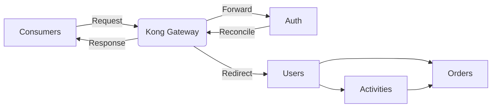

<h1 align="center">Learn Kong API Gateway with Hands-On Practices.</h1>

---

## Table of Contents

* [Introduction to Kong](#introduction-to-kong)
   * [Key Features of Kong](#key-features-of-kong)
   * [Kong Use-Cases](#kong-use-cases)
   * [Why Use Kong](#why-use-kong)
   * [Kong Architecture](#kong-architecture)
* [Getting Started with Kong](#getting-started-with-kong)
   * [Kong Configuration](#kong-configuration)
   * [Steps to Run](#steps-to-run)
* [Kong Components and Modes](#kong-components-and-modes)
   * [Kong Components and Ports](#kong-components-and-ports)
   * [Kong in a Cluster](#kong-in-a-cluster)
* [What Can Be Done with Kong](#what-can-be-done-with-kong)

---

# Introduction to Kong
[Kong](https://konghq.com/) is a scalable, open-source API Gateway and Microservices Management Layer, designed to manage and secure APIs and microservices. It acts as a middleware between API consumers and upstream services, providing functionalities such as load balancing, authentication, rate limiting, and logging.

## Key Features of Kong

- **Scalability**: Kong is built on top of NGINX and can handle a large number of requests per second, making it suitable for high-traffic environments.
- **Extensibility**: With a rich ecosystem of plugins, Kong can be extended to meet various API management needs, including security, traffic control, and analytics.
- **Open Source**: As an open-source project, Kong benefits from a large community of developers and contributors, ensuring continuous improvement and support.

## Kong Use-Cases

Kong is widely used in various scenarios, including:

- **Microservices Management**: Simplify the management of microservices by providing a unified gateway for all services.
- **API Monetization**: Enable API providers to monetize their APIs by implementing rate limiting and authentication.
- **Security Enhancement**: Protect APIs from unauthorized access and attacks by implementing robust security measures.
- **Scalability**: Scale applications seamlessly by distributing traffic across multiple instances and regions.

## Why Use Kong

Kong offers several advantages that make it a popular choice for API management:

- **High Performance**: Built on top of NGINX, Kong is capable of handling a large number of requests per second with low latency. As per benchmarking stats it delivers outstanding performance, handling up to 130K+ RPS with 3.82ms p95 latency, and still maintains 96.3k RPS even with rate limiting and authentication enabled.
- **Open Source**: As an open-source project, Kong benefits from a large community of contributors and continuous improvements.
- **Extensibility**: With a rich ecosystem of plugins, Kong can be easily extended to meet specific needs.
- **Flexibility**: Supports both database and DB-less modes, allowing users to choose the best configuration for their environment.
- **Comprehensive API Management**: Kong provides a full suite of features for API management, including load balancing, authentication, rate limiting, and more, making it a one-stop solution for managing APIs.
- **Security Features**: With built-in security features like SSL termination and various authentication mechanisms, Kong ensures that your APIs are protected from unauthorized access and attacks.

## Kong Architecture

Kong's architecture consists of two main components:

- **Kong Gateway**: The core component that processes incoming requests, applies configured plugins, and forwards requests to upstream services.
- **Kong Admin API**: Provides a RESTful interface for managing Kong's configuration, including services, routes, and plugins.

## Getting Started with Kong

To start using Kong, you need to set up a Kong Gateway and configure it to manage your APIs. This involves defining services and routes, and applying plugins to enhance functionality.

### Kong Configuration

The `kong.yaml` file contains a basic configuration to get you started with Kong. It defines several key components:

- **Service**: Represents an external API or microservice, such as `example-service` pointing to a mock endpoint.
- **Route**: Determines how requests are forwarded to the service, such as `example-route` with the path `/users`.
- **Plugins**: Extend Kong's functionality by adding features like authentication, rate limiting, and logging. Plugins can be applied globally or to specific services and routes.
- **Consumers**: Represent users or applications consuming the APIs. Consumers can be associated with credentials and plugins to manage access and apply policies.
- **Certificates**: Used for SSL termination, allowing Kong to handle HTTPS traffic securely.
- **Upstreams**: Define load balancing configurations for distributing requests across multiple targets.

This configuration allows you to trace incoming requests to the mock endpoint and test the setup effectively.

### Steps to Run

1. Ensure Docker is installed and running.
2. Navigate to the project root path and run the following command to start Kong using docker-compose:

   ```bash
   docker-compose up
   ```

3. Access Kong by sending a request to:

   ```bash
   curl -i http://localhost:8000/users
   ```

This request will be proxied by Kong as per the configuration of `kong.yaml`. To see the request hit, visit [https://kong-test.requestcatcher.com](https://kong-test.requestcatcher.com), where you will find the request traces.


## Kong Components and Modes

Kong operates in two main modes: **Database Mode** and **DB-less Mode**.

- **Database Mode**: In this mode, Kong uses a database (PostgreSQL or Cassandra) to store its configuration. This allows for dynamic updates to the configuration via the Admin API without restarting Kong. It's suitable for environments where configuration changes are frequent and need to be applied in real-time.

- **DB-less Mode**: In this mode, Kong does not use a database. Instead, it relies on a declarative configuration file (YAML or JSON) to define its configuration. This mode is ideal for environments where configuration changes are infrequent and can be managed through version control systems. It offers faster startup times and reduced operational complexity.

In this lesson, we will follow the YAML-based declarative approach, which is part of the DB-less mode.

### Kong Components and Ports

Kong consists of several key components, each serving a specific purpose and operating on different ports:

- **Proxy**: The core component that handles incoming requests and forwards them to the appropriate upstream services. It typically listens on port `8000` for HTTP traffic and `8443` for HTTPS traffic.

- **Admin API**: Provides a RESTful interface for managing Kong's configuration, including services, routes, and plugins. It usually listens on port `8001` for HTTP traffic and `8444` for HTTPS traffic.

- **Dev Portal**: An optional component that provides a developer-friendly interface for exploring and consuming APIs managed by Kong. It typically operates on port `8003`.

These components work together to provide a comprehensive API management solution, allowing you to manage, secure, and scale your APIs effectively.


### Kong in a Cluster

Below is an enhanced diagram illustrating how Kong protects requests entering a cluster and reconciles requests between multiple services:



Kong acts as a gateway, managing and securing traffic between API consumers and a cluster of services, ensuring requests are properly reconciled and redirected within the cluster.


## What Can Be Done with Kong

Kong is a versatile API gateway that can be used to manage, secure, and extend APIs and microservices. Here are some of the key functionalities it offers:

- **Load Balancing**: Distribute incoming requests across multiple upstream services to ensure high availability and reliability.
- **Authentication**: Implement various authentication mechanisms such as OAuth2, JWT, and basic authentication to secure APIs.
- **Rate Limiting**: Control the number of requests a client can make to an API within a specified time frame to prevent abuse.
- **Caching**: Cache frequently accessed data to improve response times and reduce load on upstream services.
- **Logging**: Capture detailed logs of API requests and responses for monitoring and analysis.
- **Traffic Control**: Manage and route traffic efficiently using plugins and custom logic.
- **Transformation**: Modify requests and responses on the fly to meet specific requirements.
- **Monitoring and Analytics**: Collect and analyze metrics to monitor API performance and usage.
- **SSL Termination**: Decrypt incoming SSL/TLS connections at the gateway level, allowing backend services to handle unencrypted traffic.
- **API Versioning**: Implement versioning strategies to manage changes and deprecations of APIs.
- **API Documentation**: Generate and serve API documentation to assist developers in understanding and using APIs.

In this repository, we will explore various practices with Kong through hands-on experiments. By engaging in practical exercises, will try to take a deeper understanding of how to effectively manage and secure APIs using Kong.
